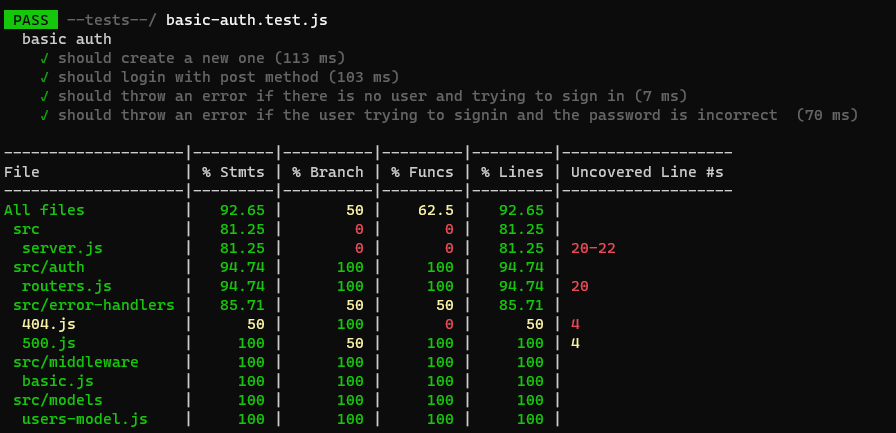
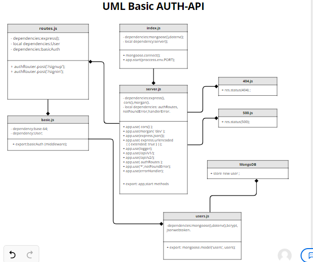

# basic-auth

[PR](https://github.com/jdeitawimostafa/basic-auth/pull/2)

[heroku deployment]()

 ## **Setup**
* .env requirements
  * PORT - Port Number

## **Running the app**
npm start

## **Tests**

      * POST to /signup to create a new user
      * POST to /signin to login as a user (use basic auth)
      * Need tests for auth middleware and the routes
      * Does the middleware function (send it a basic header)
    * Do the routes assert the requirements (signup/signin)

* Endpoint: 

       * /api/v1/signup for create a new user . 

       * /api/v1/signin for signin . 

**npm start**

    * /api/v1/signup : json object
          [
          {
           "_id": "60a65f8c4839a32019dd4857",
            "username": "rice",
           "password": "$2b$10$ubOOaimv0zWtiIO0Hg759.BB.7BLOOjtwHtpuoFJTF6j2hF53avi6",
            "__v":0
            }
           ]
           
           
           
           
     * /api/v1/signin : json object 
        [
          {
           "_id": "60a65f8c4839a32019dd4857",
            "username": "mostafa",
            "password": "$2b$10$ubOOaimv0zWtiIO0Hg759.BB.7BLOOjtwHtpuoFJTF6j2hF53avi6",
            "__v":0
            }
           ]  
           
           
           
  
   
   **uml diagram** 
   
 
   
 

***Thank you!!***
